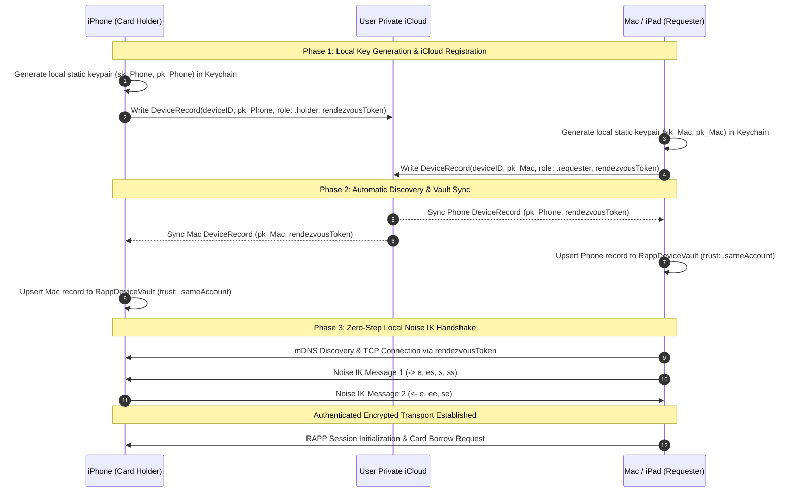

# Automatic & Secure Same-AppleID Device Pairing

## 1. Executive Summary

This document specifies the architecture, cryptographic protocol, security model, and implementation roadmap for **Automatic & Secure Same-AppleID Device Pairing** in ReFineID.

When a user has the ReFineID card installed/read on their iPhone, any Mac or iPad signed into the same Apple ID will automatically and securely discover and pair with the iPhone upon opening the app—**with zero manual pairing code entry**, while preserving strict end-to-end cryptographic boundaries and hardware-backed card security.

---

## 2. Security Guarantees & Threat Model

### 2.1 Core Security Invariants
1. **Private Keys Never Sync**:
   - Every device generates its own static Curve25519 / Ed25519 keypair in its local Data Protection Keychain (`kSecAttrAccessibleAfterFirstUnlockThisDeviceOnly`).
   - Private keys **never** leave the originating device and are **never** synced to iCloud or transferred across the network.
2. **Authenticated Key Distribution via Private iCloud**:
   - Only public keys ($pk_A, pk_B$), device metadata (name, model, role), and rotating rendezvous tokens sync across the user's private iCloud container (`NSUbiquitousKeyValueStore` / private CloudKit database).
   - Because the iCloud container is private to the user's Apple ID account, third parties and off-path attackers cannot inject or substitute public keys.
3. **Pre-Authenticated Mutual Noise Handshake (Noise IK)**:
   - Instead of an interactive passkey/PIN (Noise XXpsk3), same-account devices execute a **Noise IK** handshake (Initiator knows Responder's static public key beforehand).
   - Provides full mutual authentication, forward secrecy for session traffic, and replay protection.
4. **Card Authorization Boundary Preserved**:
   - The card-holding iPhone remains the authoritative gatekeeper for the physical smartcard.
   - Operations requiring explicit user confirmation (e.g. signature PIN 2 / biometric authorization prompt) continue to execute on the iPhone holding the card.

---

## 3. Cryptographic Protocol & Handshake



### 3.1 Noise IK Handshake Details
- **Pattern**: `Noise_IK_25519_ChaChaPoly_SHA256`
- **Message 1 (`Mac -> iPhone`)**:
  - `-> e, es, s, ss`
  - Ephemeral key $e$ generated by Mac.
  - Diffie-Hellman $es = \text{DH}(e, pk_{\text{Phone}})$.
  - Mac static public key $s$ encrypted with key derived from $es$.
  - Diffie-Hellman $ss = \text{DH}(sk_{\text{Mac}}, pk_{\text{Phone}})$.
- **Message 2 (`iPhone -> Mac`)**:
  - `<- e, ee, se`
  - Ephemeral key $e$ generated by iPhone.
  - Diffie-Hellman $ee = \text{DH}(e, e_{\text{Mac}})$.
  - Diffie-Hellman $se = \text{DH}(sk_{\text{Phone}}, e_{\text{Mac}})$.
- **Output**:
  - Mutual symmetric cipher states ($k_1, k_2$) for streaming APDUs and RAPP framing.
  - Zero round-trip user friction.

---

## 4. Architecture & Data Structures

### 4.1 iCloud Device Record (`RappCloudDeviceRecord`)
```swift
public struct RappCloudDeviceRecord: Codable, Sendable, Identifiable {
  public let id: UUID                      // Device unique identifier
  public let modelName: String             // e.g. "MacBook Pro (16-inch, 2024)"
  public let deviceName: String            // e.g. "Petri's MacBook Pro"
  public let role: RappDeviceRole          // .holder | .requester
  public let staticPublicKey: Data         // 32-byte Curve25519 public key
  public let rendezvousToken: Data         // 32-byte shared mDNS discovery seed
  public let updatedAt: Date               // Timestamp for freshness/liveness
  public let appBuildVersion: String       // e.g. "26.8.24 (225)"
}
```

### 4.2 Synchronization Engine (`RappCloudSyncCoordinator`)
- Implemented in `CardCore/Sources/CardCore/RappCloudSyncCoordinator.swift`.
- Subscribes to `NSUbiquitousKeyValueStore.didChangeExternallyNotification`.
- Reads and publishes device registration payload under key `fi.refineid.rapp.devices`.
- Automatically populates and updates `RappDeviceVault` on local storage.
- Automatically initiates connection when an active card holder is detected on the same local network / WiFi.

### 4.3 UI & User Controls
- **Settings Screen**:
  - Toggle: `Automatic iCloud Pairing` (Enabled by default).
  - Status indicator: `iCloud Sync: Connected (X devices paired)`.
  - Device list with same-AppleID badge ("My Devices").
- **Manual Override & Revocation**:
  - User can remove a device or disable auto-pairing at any time.
  - Removing a device immediately rotates the rendezvous token and deletes the peer from the iCloud container.

---

## 5. Phased Implementation Plan

### Phase 1: Storage & Cloud Synchronization Layer
- [ ] Define `RappCloudDeviceRecord` and `RappCloudSyncCoordinator` using `NSUbiquitousKeyValueStore`.
- [ ] Add iCloud entitlement (`com.apple.developer.ubiquity-kvstore-identifier`) to iOS and macOS targets.
- [ ] Integrate `RappCloudSyncCoordinator` with `RappDeviceVault` to auto-import trusted same-account peers.

### Phase 2: Noise IK Handshake Implementation
- [ ] Implement `Noise_IK_25519_ChaChaPoly_SHA256` pattern in `CardCore` alongside existing `Noise_XXpsk3`.
- [ ] Add handshake negotiation: when connecting to a peer known in `RappDeviceVault` with trust `.sameAccount`, execute Noise IK directly.
- [ ] Add fallback to manual pairing (Noise XXpsk3 with 6-character code) for cross-account or non-iCloud setups (e.g. Android $\leftrightarrow$ Apple).

### Phase 3: Automatic Background Discovery & Connection
- [ ] Monitor network reachability and mDNS advertisements for same-account `rendezvousToken` hashes.
- [ ] Auto-dial the card-holding iPhone when Mac or iPad app opens and requests smart card operations.
- [ ] Reconnection & self-healing management when roaming across networks.

### Phase 4: Verification, Security Audit & UI Testing
- [ ] Unit tests for `RappCloudDeviceRecord` serialization, conflict resolution, and key management.
- [ ] Integration tests for Noise IK handshake state machine, replay protection, and error handling.
- [ ] End-to-end two-device test matrix across macOS, iPadOS, and iOS.
